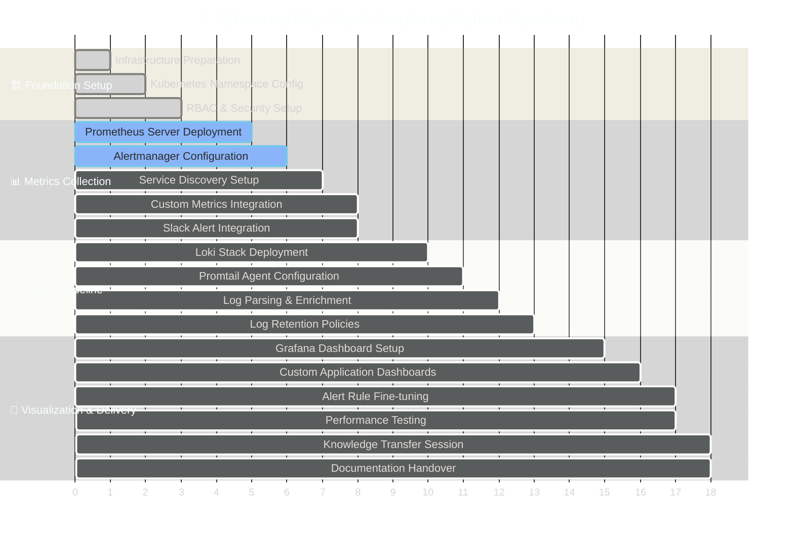

```mermaid
%%{init: {'theme':'dark', 'themeVariables': {'primaryColor': '#1e1e2e', 'primaryTextColor': '#cdd6f4', 'primaryBorderColor': '#89b4fa', 'lineColor': '#89b4fa', 'gridColor': '#45475a', 'c0': '#f38ba8', 'c1': '#fab387', 'c2': '#f9e2af', 'c3': '#a6e3a1', 'c4': '#94e2d5', 'c5': '#89b4fa', 'c6': '#cba6f7', 'c7': '#f2cdcd', 'activeTaskBkgColor': '#89b4fa', 'activeTaskBorderColor': '#74c7ec', 'gridColor': '#585b70', 'section0': '#f38ba8', 'section1': '#fab387', 'section2': '#a6e3a1', 'section3': '#89b4fa'}}}%%
gantt
    title 🚀 Observability Stack Implementation Roadmap
    dateFormat X
    axisFormat %s
    
    section 🏗️ Foundation Setup
    Infrastructure Preparation     :done, foundation1, 0, 1
    Kubernetes Namespace Config    :done, foundation2, 1, 2
    RBAC & Security Setup         :done, foundation3, 2, 3
    
    section 📊 Metrics Collection
    Prometheus Server Deployment  :active, metrics1, 3, 5
    Alertmanager Configuration    :active, metrics2, 4, 6
    Service Discovery Setup       :metrics3, 5, 7
    Custom Metrics Integration    :metrics4, 6, 8
    Slack Alert Integration       :metrics5, 7, 8
    
    section 📝 Logging Pipeline
    Loki Stack Deployment        :logging1, 8, 10
    Promtail Agent Configuration  :logging2, 9, 11
    Log Parsing & Enrichment     :logging3, 10, 12
    Log Retention Policies       :logging4, 11, 13
    
    section 🎨 Visualization & Delivery
    Grafana Dashboard Setup       :viz1, 12, 15
    Custom Application Dashboards :viz2, 13, 16
    Alert Rule Fine-tuning        :viz3, 14, 17
    Performance Testing           :viz4, 15, 17
    Knowledge Transfer Session    :viz5, 16, 18
    Documentation Handover        :viz6, 17, 18
```
