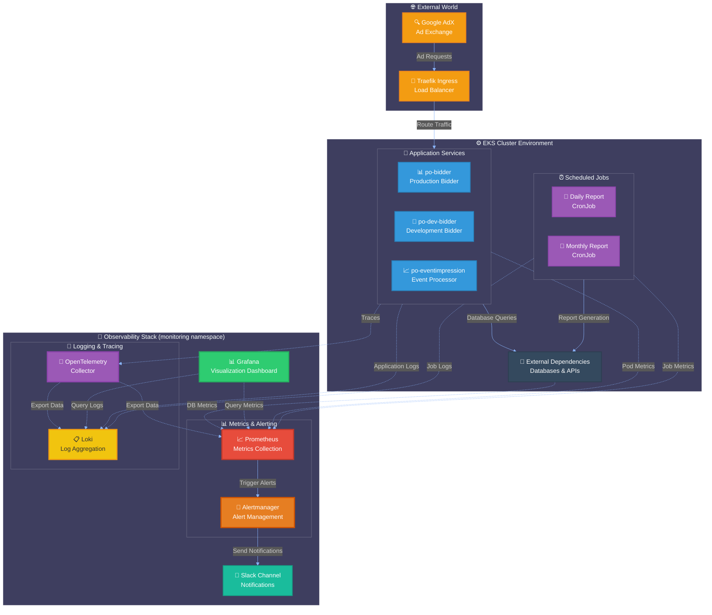

```mermaid
%%{init: {'theme':'dark', 'themeVariables': { 'primaryColor': '#1e1e2e', 'primaryTextColor': '#cdd6f4', 'primaryBorderColor': '#89b4fa', 'lineColor': '#89b4fa', 'secondaryColor': '#313244', 'tertiaryColor': '#45475a', 'background': '#1e1e2e', 'mainBkg': '#1e1e2e', 'secondBkg': '#313244', 'tertiaryBkg': '#45475a'}}}%%
graph TB
    subgraph EXT ["🌐 External World"]
        A["🔍 Google AdX<br/>Ad Exchange"] 
        B["🚪 Traefik Ingress<br/>Load Balancer"]
    end
    
    subgraph CLUSTER ["⚙️ EKS Cluster Environment"]
        subgraph SERVICES ["🎯 Application Services"]
            D1["📊 po-bidder<br/>Production Bidder"]
            D2["🧪 po-dev-bidder<br/>Development Bidder"] 
            D3["📈 po-eventimpression<br/>Event Processor"]
        end
        
        subgraph JOBS ["⏰ Scheduled Jobs"]
            D4["📅 Daily Report<br/>CronJob"]
            D5["📆 Monthly Report<br/>CronJob"]
        end
        
        E["💾 External Dependencies<br/>Databases & APIs"]
    end
    
    subgraph MONITORING ["🔭 Observability Stack (monitoring namespace)"]
        subgraph METRICS ["📊 Metrics & Alerting"]
            F["📈 Prometheus<br/>Metrics Collection"]
            H["🚨 Alertmanager<br/>Alert Management"]
        end
        
        subgraph LOGS ["📝 Logging & Tracing"]
            G["📋 Loki<br/>Log Aggregation"]
            J["🔄 OpenTelemetry<br/>Collector"]
        end
        
        I["📊 Grafana<br/>Visualization Dashboard"]
        K["💬 Slack Channel<br/>Notifications"]
    end
    
    %% External Flow
    A -->|"Ad Requests"| B
    B -->|"Route Traffic"| SERVICES
    
    %% Service Dependencies
    SERVICES -->|"Database Queries"| E
    JOBS -->|"Report Generation"| E
    
    %% Metrics Collection
    SERVICES -.->|"Pod Metrics"| F
    JOBS -.->|"Job Metrics"| F
    E -.->|"DB Metrics"| F
    
    %% Logging
    SERVICES -.->|"Application Logs"| G
    JOBS -.->|"Job Logs"| G
    
    %% Tracing (Optional)
    SERVICES -.->|"Traces"| J
    J -.->|"Export Data"| F
    J -.->|"Export Data"| G
    
    %% Alerting Flow
    F -->|"Trigger Alerts"| H
    H -->|"Send Notifications"| K
    
    %% Visualization
    I -.->|"Query Metrics"| F
    I -.->|"Query Logs"| G
    
    %% Styling
    classDef external fill:#f39c12,stroke:#e67e22,stroke-width:2px,color:#fff
    classDef services fill:#3498db,stroke:#2980b9,stroke-width:2px,color:#fff
    classDef jobs fill:#9b59b6,stroke:#8e44ad,stroke-width:2px,color:#fff
    classDef prometheus fill:#e74c3c,stroke:#c0392b,stroke-width:3px,color:#fff
    classDef loki fill:#f1c40f,stroke:#f39c12,stroke-width:3px,color:#333
    classDef alertmanager fill:#e67e22,stroke:#d35400,stroke-width:3px,color:#fff
    classDef grafana fill:#2ecc71,stroke:#27ae60,stroke-width:3px,color:#fff
    classDef otel fill:#9b59b6,stroke:#8e44ad,stroke-width:3px,color:#fff
    classDef dependencies fill:#34495e,stroke:#2c3e50,stroke-width:2px,color:#fff
    classDef notifications fill:#1abc9c,stroke:#16a085,stroke-width:2px,color:#fff
    
    class A,B external
    class D1,D2,D3 services
    class D4,D5 jobs
    class F prometheus
    class G loki
    class H alertmanager
    class I grafana
    class J otel
    class E dependencies
    class K notifications
```
